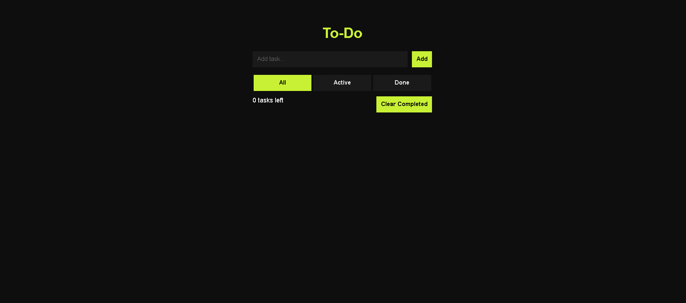

# 📝 Todo App

A responsive Todo App built using HTML, CSS, and JavaScript with LocalStorage support. This app allows users to manage daily tasks efficiently with a clean and interactive UI.

---

## 🚀 Features

- ✅ Add new tasks  
- ❌ Delete tasks  
- ✔️ Mark tasks as completed  
- 🔍 Filter tasks (All / Active / Completed)  
- 💾 Persistent storage using LocalStorage  
- 📱 Responsive design  

---

## 🛠 Tech Stack

- HTML  
- CSS  
- JavaScript  
- LocalStorage  

---

## 📸 Screenshot

Example:

---

## 🌐 Live Demo

https://priyanshu-todo-app.netlify.app

---

## 📂 Project Structure
